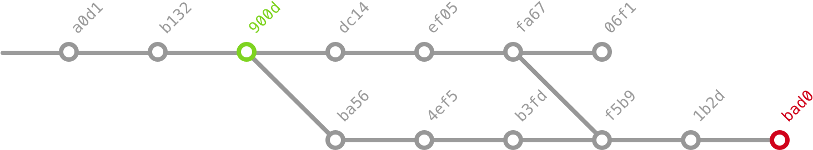
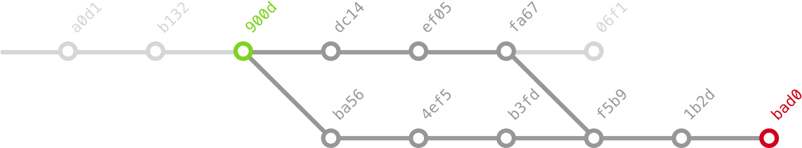
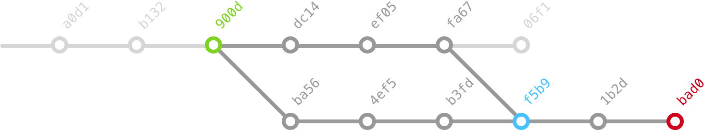
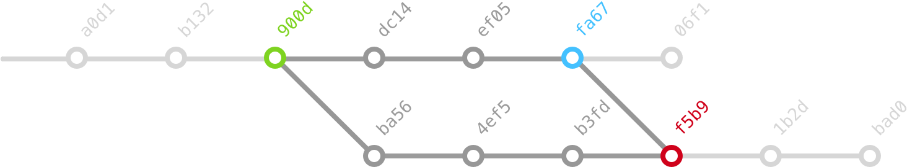
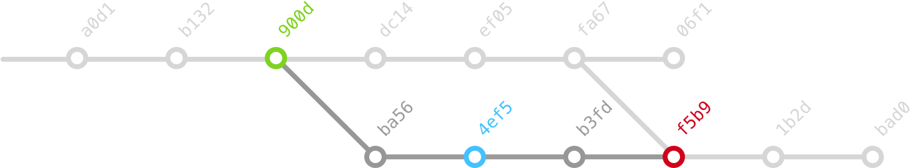
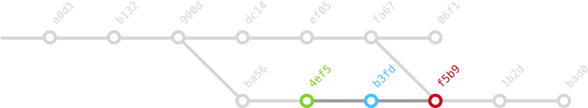
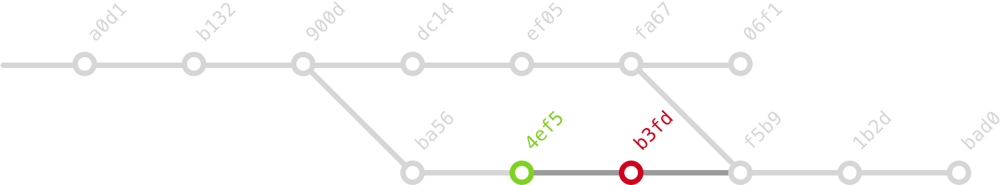

# How to Use `git bisect`

Find the change that introduced a bug in your code, **quickly**.

The [`git bisect`](https://git-scm.com/docs/git-bisect) command helps you to find which change introduced a bug in your code. It’s easy and quick, but most people don’t know about it.

## The Problem

You notice that in the most recent commit (let’s say `4a4e`), a feature is not working, and you remember that at some point in the past (let’s say commit `f8a4`) it was working just fine. The task is to find out which commit introduced the bug.

## The Solution: Git Bisect

Git uses the [bisection algorithm](https://en.wikipedia.org/wiki/Bisection_method) to help you search the offending commit. To start, you need to mark a `bad` commit and a `good` commit, git will checkout a commit in the middle for you to test. Then you mark it either as `good` or `bad`, and then the process starts again.


We start by identifying a good (`900d`) and a bad (`bad0`) commit



Git will keep the commits that are both descendants of the good commit and ancestors of the bad commit, which will leave us with a smaller graph to work with.



Git chooses a commit between the good and bad commits. As this is a directed acyclic graph, there is no commit “in the middle”, git chooses the commit that will provide more information once tested.



Now we need to test this commit as being good or bad. Let’s say it was bad, we mark it as such and git proposes a new commit to be tested. The graph now is smaller.



We test this commit as well (let’s say it was good). In this case, the upper branch is removed from the commits to test, as we are under the assumption that only **one** commit introduced the bug.



We test the next commit (it was good) and git proposes the last comit to be tested.




We test this last commit and we are done, the first bad commit was `b3fd`.




## Example

To start the process, just invoke `git bisect start` and mark the commit as `bad`, and mark a commit that was working `f8a4` as `good`.

```
(4a4e) $ git bisect start
(4a4e) $ git bisect bad
(4a4e) $ git bisect good f8a4

Bisecting: 7 revisions left to test after this (roughly 3 steps)
[cae5] Rename function
```

Git will checkout a commit in the middle, you need to test your code to see if this version is working:

```bash
(cae5) $ node add.js 1 2 3  // 6
(cae5) $  git bisect good

Bisecting: 7 revisions left to test after this (roughly 3 steps)
[0bca] Rename function
```

Git will checkout a version in the middle, you test again and mark it as good or bad. After a couple of steps, you will find the offending commit:


```bash
# 3 or 4 steps later ...

(90d0) $ git bisect bad

5e3c is the first bad commit
commit 5e3c
Author: Pablo Navarro Castillo <pnavarrc@gmail.com>  // <- me :blush:
Date:   Sat Apr 16 11:02:21 2016 -0300

    read all input arguments

:100755 100755 f111 d7fc M	add.js

(5e3c) $ git reset
```

Now that we know which commit is the bad one, we can look at the diff to see what changed:

```
$ git show 5e3c5e

commit 5e3c
Author: Pablo Navarro Castillo <pnavarrc@gmail.com>
Date:   Sat Apr 16 11:02:21 2016 -0300

    read all input arguments

diff --git a/add.js b/add.js
index f1110f6..d7fc703 100755
--- a/add.js
+++ b/add.js
@@ -8,7 +8,7 @@ function toInt(num) {
 // Parse the input arguments
 function readNumbers(input) {
   var numArgs = input.length;
-  return input.slice(2, numArgs).map(toInt);
+  return input.slice(1, numArgs).map(toInt);
 }

 // Read and parse command line arguments
```

The next step is to fix the bug, commit and :shipit:

## Learn more

- [How to use Git Bisect — Pablo Navarro, JSConf UY 2016 (YouTube)](https://youtu.be/R6F6lnbnNbc?t=14m57s)
- [Git Bisect Documentation](https://git-scm.com/docs/git-bisect)
- [Paper on Git Bisect (lk 2009)](https://git-scm.com/docs/git-bisect-lk2009.html)
